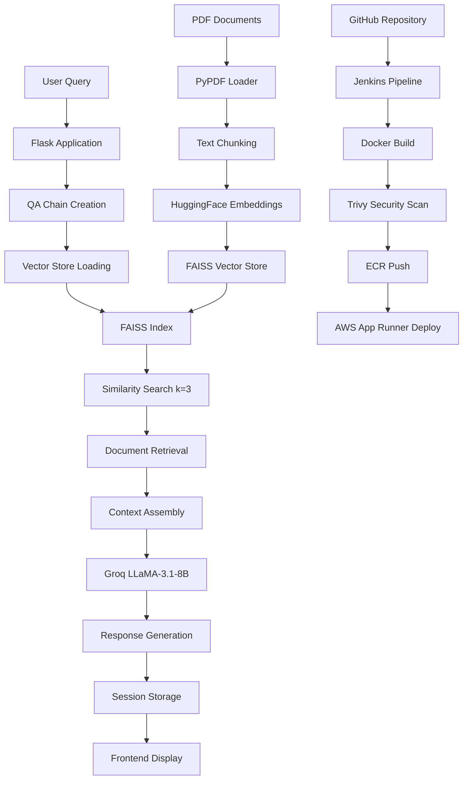
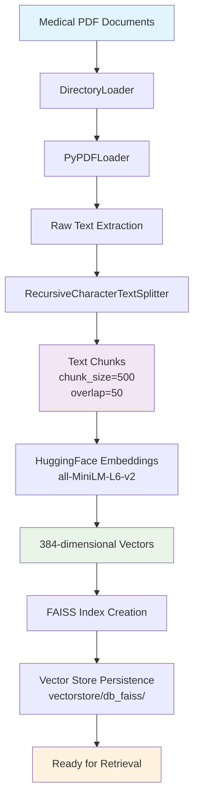

# Medical RAG Chatbot

## Technical Overview

A production-grade Retrieval-Augmented Generation (RAG) system for medical information retrieval, built with LangChain, FAISS vector store, and Groq LLaMA-3.1-8B inference. The system implements semantic search over medical documents with automated CI/CD deployment to AWS App Runner via Jenkins pipeline.

**Core Architecture:**
- **Vector Store**: FAISS with HuggingFace sentence-transformers/all-MiniLM-L6-v2 embeddings
- **LLM**: Groq-hosted LLaMA-3.1-8B-instant with 0.3 temperature, 256 max tokens
- **Retrieval**: Similarity search with k=3 documents, score_threshold=0.7
- **Framework**: Flask web application with session-based conversation management
- **Document Processing**: PyPDF loader with RecursiveCharacterTextSplitter (chunk_size=500, overlap=50)



## CI/CD Pipeline Architecture

### Jenkins Pipeline Stages

**1. Source Code Management**
```groovy
checkout scmGit(branches: [[name: '*/main']], 
    userRemoteConfigs: [[credentialsId: 'github-token', 
    url: 'https://github.com/nasim-raj-laskar/Med_RAGbot.git']])
```

**2. Container Security & Registry**
- **Docker Build**: Multi-stage containerization with Python 3.10-slim base
- **Security Scanning**: Trivy vulnerability assessment (HIGH/CRITICAL severity)
- **Registry Push**: Automated ECR deployment with AWS CLI authentication
- **Image Tagging**: Dynamic tagging with `${accountId}.dkr.ecr.${AWS_REGION}.amazonaws.com/${ECR_REPO}:${IMAGE_TAG}`

**3. AWS App Runner Deployment**
```bash
SERVICE_ARN=$(aws apprunner list-services \
    --query "ServiceSummaryList[?ServiceName=='${SERVICE_NAME}'].ServiceArn" \
    --output text --region ${AWS_REGION})
aws apprunner start-deployment --service-arn $SERVICE_ARN
```

### Infrastructure Components

- **Container Registry**: Amazon ECR with automated login via AWS STS
- **Compute Platform**: AWS App Runner with auto-scaling capabilities
- **Security**: IAM role-based access with least privilege principles
- **Monitoring**: Health check endpoint (`/health`) for service validation

## RAG Implementation Details

### Vector Store Configuration
```python
# Embedding Model
HuggingFaceEmbeddings(
    model_name="sentence-transformers/all-MiniLM-L6-v2",
    model_kwargs={'device': 'cpu'}
)

# Retrieval Configuration  
retriever=db.as_retriever(
    search_kwargs={'k': 3, 'score_threshold': 0.7}
)
```

### LLM Integration
```python
ChatGroq(
    groq_api_key=GROQ_API_KEY,
    model_name="llama-3.1-8b-instant", 
    temperature=0.3,
    max_tokens=256
)
```

### Document Processing Pipeline



1. **Ingestion**: DirectoryLoader with PyPDFLoader for medical documents
2. **Chunking**: RecursiveCharacterTextSplitter with 500-character chunks, 50-character overlap
3. **Vectorization**: Sentence transformer embeddings with 384-dimensional vectors
4. **Indexing**: FAISS flat index with L2 distance metric

## Quick Start

### Prerequisites
```bash
# Environment Variables
GROQ_API_KEY=<your_groq_api_key>
HF_TOKEN=<your_huggingface_token>
```

### Local Development
```bash
# Install dependencies
pip install -e .

# Process documents (one-time setup)
python app/components/data_loader.py

# Start application
python app/application.py
```

### Docker Deployment
```bash
# Build container
docker build -t medical-rag-bot .

# Run container
docker run -p 5000:5000 --env-file .env medical-rag-bot
```

### Health Monitoring
```bash
# Health check
curl http://localhost:5000/health

# Response
{
  "status": "healthy",
  "timestamp": "2025-10-03T17:00:00.000Z", 
  "service": "Medical RAG Bot"
}
```

## API Endpoints

| Endpoint | Method | Description |
|----------|--------|-------------|
| `/` | GET/POST | Main chat interface |
| `/clear` | POST | Clear conversation history |
| `/health` | GET | Service health status |

## Performance Metrics

- **Response Time**: ~2-4 seconds (including LLM inference)
- **Vector Search**: Sub-100ms for similarity search
- **Concurrent Users**: Supports session-based multi-user access
- **Document Capacity**: Scalable FAISS index for large document collections

## Security Features

- **Container Scanning**: Trivy integration in CI pipeline
- **Secrets Management**: Environment-based configuration
- **Input Validation**: Client-side and server-side validation
- **Session Security**: Flask session management with secure cookies

## Technology Stack

| Component | Technology |
|-----------|------------|
| **Backend** | Flask, LangChain, FAISS |
| **LLM** | Groq LLaMA-3.1-8B-instant |
| **Embeddings** | HuggingFace Transformers |
| **Frontend** | HTML5, CSS3, Vanilla JavaScript |
| **Containerization** | Docker, Multi-stage builds |
| **CI/CD** | Jenkins, AWS CLI |
| **Cloud** | AWS App Runner, ECR |
| **Security** | Trivy, IAM |